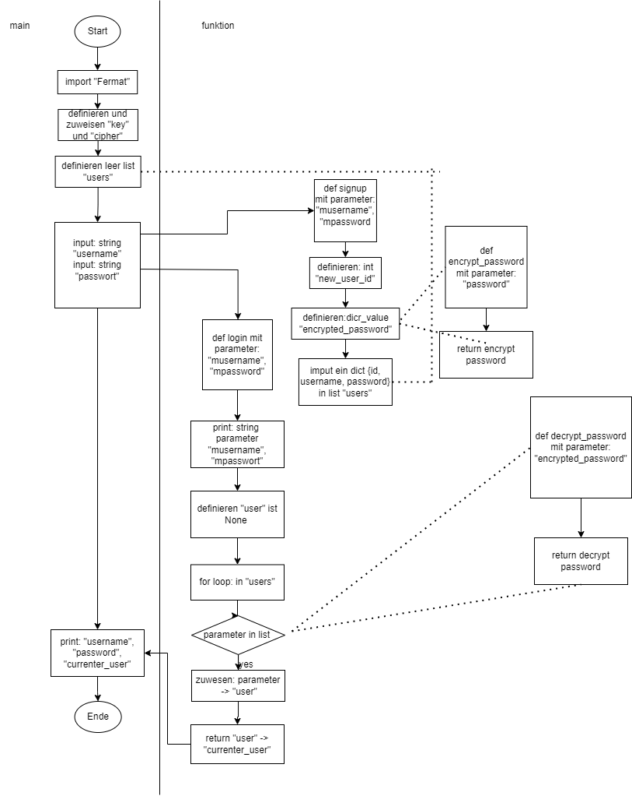

# Verschlüsselung

## Aufgabe 1 Linux Befehle

- Was ist der absolute Pfad in Linux
    > Der absolute Pfad ist der vollständige Pfad zu einer Datei oder einem Verzeichnis, beginnend vom Wurzelverzeichnis ``/``.
- Was ist der relative Pfad in Linux
    > Der relative Pfad gibt den Weg zu einer Datei oder einem Verzeichnis relativ zum aktuellen Arbeitsverzeichnis an.
- Was macht der Befehl ``rm -rf /`` (!!!NICHT AUSFÜHREN!!!)
    > Dieser Befehl `rm` löscht rekursiv `-r` und unwiderruflich ``-f`` alle Dateien und Verzeichnisse im Wurzelverzeichnis ``/``.
- Wo befindet sich das Benutzerverzeichnis in Linux
    > Die Benutzerverzeichnisse befinden sich typischerweise im ``/home``-Verzeichnis. Jeder Benutzer hat sein eigenes Unterverzeichnis.
- Wie navigiere ich mich von egal wo in das Benutzerverzeichnis
    > ``cd ~``

## Aufgabe 2 Verschlüsselung

## Aufgabe 3

> Reverse Word Order
>
> strings
>
> Exercise 15 (and Solution)
>
> Write a program (using functions!) that asks the user for a long string containing multiple words. Print back to the user the same string, except with the words in backwards order.
