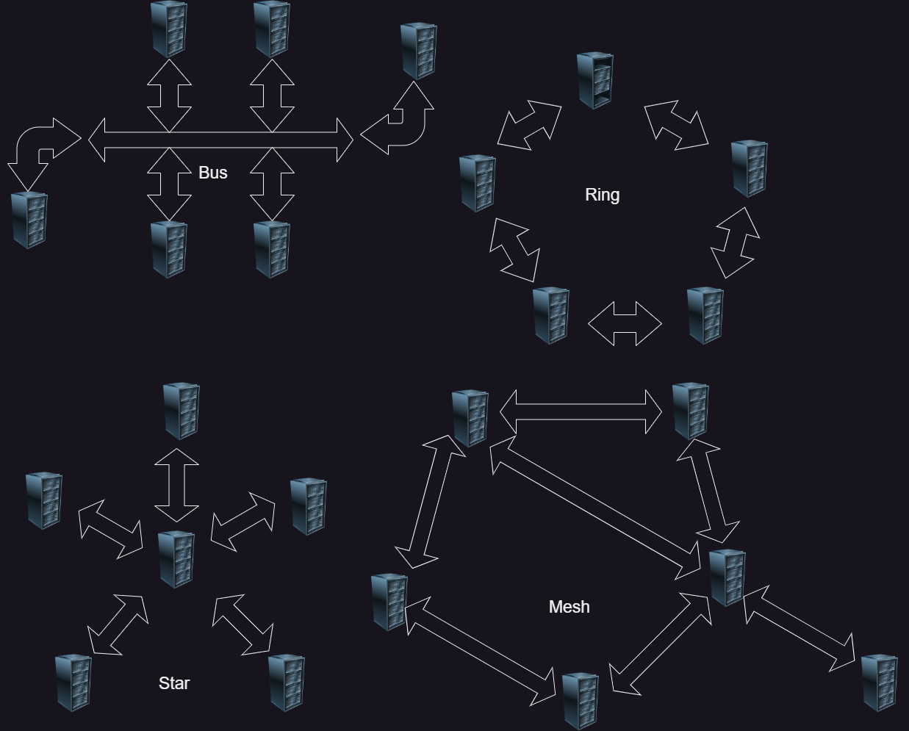

# Netzwerktopologien

# Ring-Topologie

## Definition: 

Alle Geräte sind durch Punkt-zu-Punkt-Verbindungen zu einem geschlossenen Ring verbunden, Daten werden in eine Richtung oder bidirektional übertragen.

## Vorteile:

- Einfache Datenübertragung und Fehlerlokalisierung.

- Stabilere Leistung, geeignet für kleine bis mittelgroße Netzwerke.

## Nachteile:

- Fehlerdiagnose ist schwierig, ein Geräteausfall kann das gesamte Netzwerk beeinträchtigen../images/

- Schlechte Erweiterbarkeit, das Hinzufügen von Geräten erfordert eine Netzunterbrechung.

# Bus-Topologie

## Definition: 

Alle Geräte teilen sich eine gemeinsame Kommunikationsleitung (Bus), über die Daten übertragen werden.

## Vorteile:

- Niedrige Kosten, einfache Verkabelung.

- Geeignet für kleine lokale Netzwerke, einfach Geräte hinzuzufügen oder zu entfernen.

## Nachteile:

- Fehlerdiagnose ist schwierig, ein Fehler an einer Stelle beeinträchtigt das gesamte Netzwerk.

- Hohe Kollisionswahrscheinlichkeit, die Leistung nimmt mit der Anzahl der Geräte ab.

# Mesh-Topologie

## Definition: 

Jedes Gerät ist direkt mit anderen Geräten verbunden, wodurch ein Netzwerksystem entsteht.

## Vorteile:

- Hohe Zuverlässigkeit und Ausfallsicherheit, eine fehlerhafte Verbindung beeinträchtigt nicht den Datenfluss.

- Hervorragende Leistung, geeignet für große Netzwerke, mehrere Übertragungswege.

## Nachteile:

- Hohe Kosten, komplexe Verkabelung.

- Installation und Wartung sind aufwendig.

# Stern-Topologie

## Definition: 
Alle Geräte sind über einzelne Verbindungen mit einem zentralen Knoten (z.B. Switch oder Hub) verbunden.

## Vorteile:

- Einfache Verwaltung und Fehlerlokalisierung, ein Geräteausfall beeinträchtigt nicht andere Geräte.

- Gute Erweiterbarkeit, das Hinzufügen oder Entfernen von Geräten beeinträchtigt das gesamte Netzwerk nicht.

## Nachteile:

- Abhängigkeit vom zentralen Knoten, ein Ausfall des zentralen Knotens führt zum Netzwerkausfall.

- Höhere Verkabelungskosten, benötigt mehr Kabel im Vergleich zur Bus-Topologie.